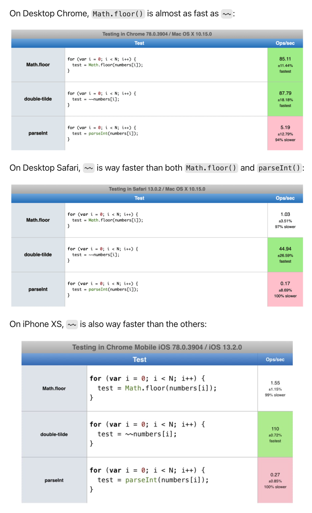
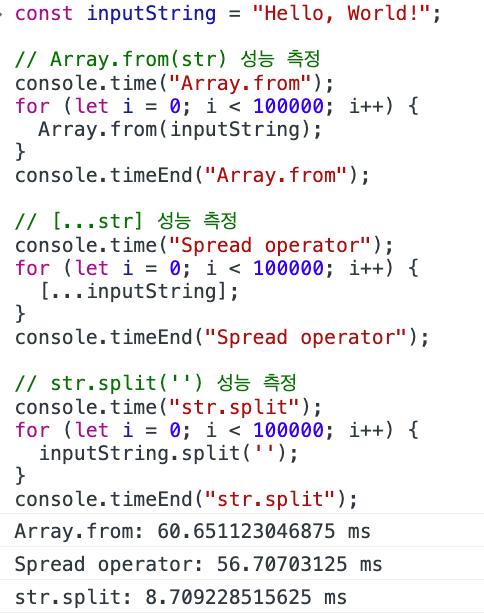
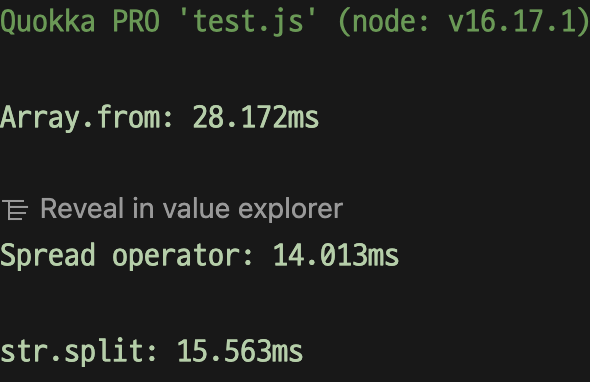
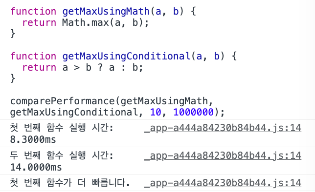
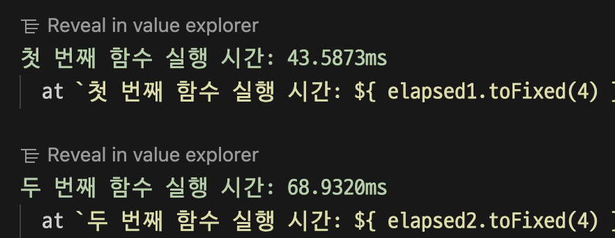
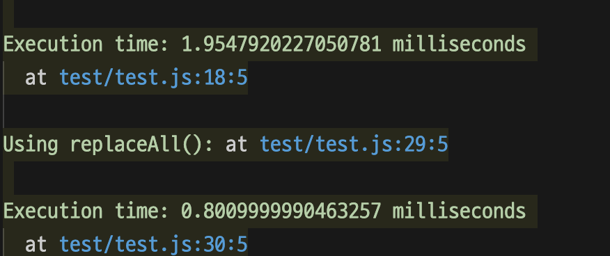
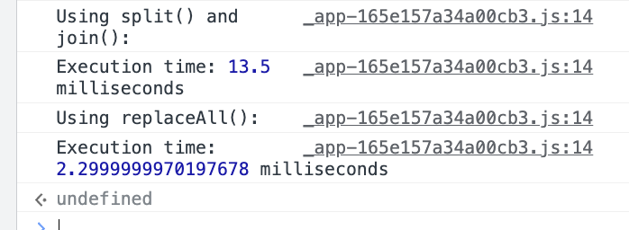
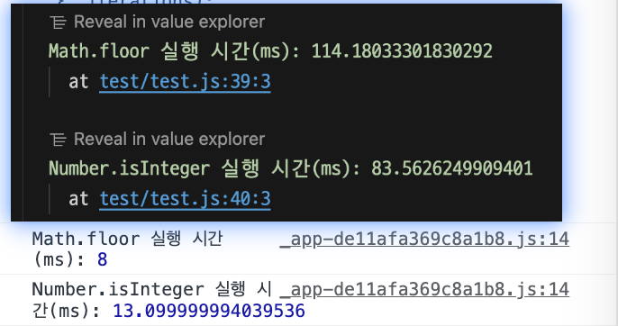
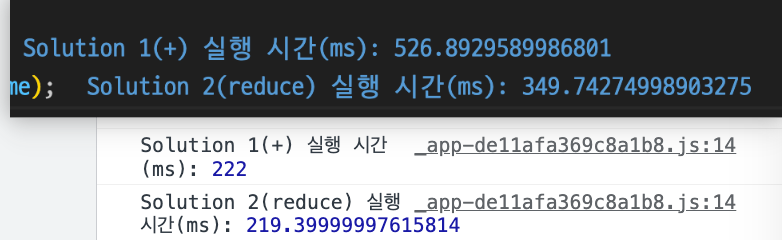

# 알고리즘 공부

## 연산속도 우선하기

여기에는 알고리즘의 효율성을 높이는 최적화 기법과 JavaScript의 내장 함수를 활용하는 방법 등이 포함될 수 있습니다. 다음은 몇 가지 예시입니다.

- 데이터 구조 선택: 적절한 데이터 구조를 선택하여 알고리즘의 실행 시간을 최적화할 수 있습니다. 예를 들어, 배열 대신 객체 또는 맵을 사용하면 검색 및 삽입 연산에 효율적입니다.

- 선형 검색 최적화: 선형 검색을 수행해야 할 때, 배열의 요소를 하나씩 확인하는 대신, Array.prototype.includes() 함수를 사용하면 연산 속도를 최적화할 수 있습니다.

```javascript
const array = [1, 2, 3, 4, 5];
const target = 3;
if (array.includes(target)) {
  console.log("찾았습니다!");
}
```
- 이진 검색 활용: 정렬된 배열에서 특정 값을 검색해야 할 때, 이진 검색 알고리즘을 활용할 수 있습니다. Array.prototype.indexOf() 함수 대신 Array.prototype.binarySearch() 함수를 사용하면 성능을 향상시킬 수 있습니다. 이진 검색은 데이터의 크기에 상관없이 O(log n)의 시간 복잡도를 가집니다.

```javascript
// 이진 검색 함수 (재귀적 구현)
function binarySearch(arr, target, start = 0, end = arr.length - 1) {
  if (start > end) return -1; // 찾지 못한 경우
  const mid = Math.floor((start + end) / 2);
  if (arr[mid] === target) return mid; // 찾은 경우
  if (arr[mid] > target) return binarySearch(arr, target, start, mid - 1); // 왼쪽 반 검색
  return binarySearch(arr, target, mid + 1, end); // 오른쪽 반 검색
}

const array = [1, 2, 3, 4, 5];
const target = 3;
const index = binarySearch(array, target);
if (index !== -1) {
  console.log("찾았습니다!");
}
```
- Memoization 활용: 중복 계산을 피하기 위해 Memoization(메모이제이션)을 활용할 수 있습니다. Memoization은 이전에 계산한 결과를 저장하여 동일한 입력이 나오면 다시 계산하지 않고 저장된 결과를 반환합니다. 이를 통해 연산 속도를 향상시킬 수 있습니다.

```javascript
const memo = {};

function fibonacci(n) {
  if (n <= 1) return n;
  if (memo[n]) return memo[n]; // 이전에 계산한 결과가 있으면 반환
  const result = fibonacci(n - 1) + fibonacci(n - 2);
  memo[n] = result; // 결과 저장
  return result;
}

console.log(fibonacci(10));
```
- 알고리즘 최적화: 알고리즘 자체를 최적화하여 실행 시간을 단축할 수 있습니다. 예를 들어, 정렬 알고리즘을 사용해야 할 때 퀵 정렬(Quick Sort)이 병합 정렬(Merge Sort)보다 더 빠르게 동작합니다. 따라서 문제에 맞는 최적의 알고리즘을 선택하는 것이 중요합니다.
## int 대신 bigint 를 써야 하는 경우는 언제일까?

`bigint`는 JavaScript의 숫자 데이터 타입 중 하나로, 정수형을 표현하는 데 사용됩니다. `bigint`는 정수의 크기에 제한이 없으며, 표현 가능한 범위가 상당히 큽니다.

`bigint`를 사용해야 하는 경우는 일반적으로 다음과 같은 상황입니다:

- 매우 큰 정수를 다룰 때: JavaScript의 기본 숫자 타입인 `number`는 **64비트 부동소수점 형식을 사용**하므로, 표현 가능한 정수의 범위에 제한이 있습니다. `bigint`를 사용하면 매우 큰 정수를 정확하게 표현할 수 있습니다.

> JavaScript의 `number` 데이터 타입은 64비트 부동소수점 형식을 사용하며, **53비트가 정수 부분을 표현하고 나머지 비트가 소수점 및 지수를 표현합니다.** 이로 인해 `number`로 표현 가능한 정수의 범위는 대략 **-9,007,199,254,740,992**부터 **9,007,199,254,740,992**까지입니다. 이 범위를 벗어나는 정수는 `number`로 정확하게 표현할 수 없으며, 부동소수점 형식으로 인해 정밀도 손실이 발생할 수 있습니다.


- 정밀도가 요구되는 계산: `bigint`는 정수에 대해 정밀한 연산을 수행할 수 있습니다. 예를 들어, 매우 큰 정수의 나눗셈이나 거듭제곱 연산을 정확하게 수행해야 할 때 `bigint`를 사용할 수 있습니다.
- 큰 정수를 다루는 암호화나 해시 알고리즘: 보안 관련 작업에서는 종종 매우 큰 정수를 다루어야 합니다. `bigint`를 사용하면 암호화 알고리즘, 해시 함수 등에서 큰 정수를 표현하고 조작할 수 있습니다.
예시로, 매우 큰 정수를 다루는 경우 `bigint`를 사용할 수 있습니다.

```javascript
const largeNumber = BigInt('123456789012345678901234567890');
console.log(largeNumber); // 123456789012345678901234567890n

const result = largeNumber ** 2n;
console.log(result); // 152415787532388367504953515625361987875019051701600625822754882812100900n
```

위의 코드에서는 `BigInt()` 함수를 사용하여 매우 큰 정수를 생성하고, `**` 연산자를 사용하여 제곱을 계산합니다. 이처럼 `bigint`를 사용하면 매우 큰 정수를 정확하게 표현하고 다룰 수 있습니다.

## 실수의 소수점 버리기 연산 속도 비교 ()



> `~~` > `Math.floor` > `parseInt` <br />
> 순으로 빠르다.

## 문자열을 배열로 바꿀 때 속도 비교
다음 코드는 모두 문자열 `const inputString = "Hello, World!"` 을 배열로 바꾼다.

- `Array.from(inputString)`
- `[...inputString]`
- `inputString.split('')`

성능측정

```js
const inputString = "Hello, World!";

// Array.from(str) 성능 측정
console.time("Array.from");
for (let i = 0; i < 100000; i++) {
  Array.from(inputString);
}
console.timeEnd("Array.from");

// [...str] 성능 측정
console.time("Spread operator");
for (let i = 0; i < 100000; i++) {
  [...inputString];
}
console.timeEnd("Spread operator");

// str.split('') 성능 측정
console.time("str.split");
for (let i = 0; i < 100000; i++) {
  inputString.split('');
}
console.timeEnd("str.split");
```

크롬:



nodejs:


## 배열 만들기

**10*10 2차원 배열 ( 내용은 0 으로 채워짐 )**
```js
const ARR_SIZE = 10;
const arr = new Array(ARR_SIZE).fill(0).map(() => new Array(ARR_SIZE).fill(0));
```

> 주의: 다음과 같이 작성하면 안된다. `fill` 인자로 `mutable` 인자를 전달하지 않도록 주의

```js
const ARR_SIZE = 10;
const arr = new Array(ARR_SIZE).fill(new Array(ARR_SIZE).fill(0))
```


## 제곱 연산하기 비교 : `**` vs `Math.pow`

> `**` 연산자가 더 빠르다.


```js
function benchmarkMathPow(x, y, iterations) {
  console.time('Math.pow');
  for (let i = 0; i < iterations; i++) {
    Math.pow(x, y);
  }
  console.timeEnd('Math.pow');
}

function benchmarkExponentiationOperator(x, y, iterations) {
  console.time('**');
  for (let i = 0; i < iterations; i++) {
    x ** y;
  }
  console.timeEnd('**');
}

// 벤치마크 테스트 실행
const x = 2;
const y = 10;
const iterations = 100000000;

benchmarkMathPow(x, y, iterations); // 크롬: 82.3ms, nodeJS: 2.25ms
benchmarkExponentiationOperator(x, y, iterations); // 크롬: 78.87 ms , nodeJS: 2.130s

```

## 큰값 연산하기 비교 : `Math.max(a,b)` vs `a>b?a:b`

> `Math.max` 승!


```js
function comparePerformance(fn1, fn2, input, iterations = 1000000) {
  // 첫 번째 함수 실행 시간 측정
  const start1 = performance.now();
  for (let i = 0; i < iterations; i++) {
    fn1(input);
  }
  const end1 = performance.now();
  const elapsed1 = end1 - start1;

  // 두 번째 함수 실행 시간 측정
  const start2 = performance.now();
  for (let i = 0; i < iterations; i++) {
    fn2(input);
  }
  const end2 = performance.now();
  const elapsed2 = end2 - start2;

  // 성능 차이 출력
  console.log(`첫 번째 함수 실행 시간: ${elapsed1.toFixed(4)}ms`);
  console.log(`두 번째 함수 실행 시간: ${elapsed2.toFixed(4)}ms`);

  if (elapsed1 < elapsed2) {
    console.log(`첫 번째 함수가 더 빠릅니다.`);
  } else if (elapsed1 > elapsed2) {
    console.log(`두 번째 함수가 더 빠릅니다.`);
  } else {
    console.log(`두 함수의 실행 시간이 동일합니다.`);
  }
}

function getMaxUsingMath(a, b) {
  return Math.max(a, b);
}

function getMaxUsingConditional(a, b) {
  return a > b ? a : b;
}

comparePerformance(getMaxUsingMath, getMaxUsingConditional, 10, 1000000);

```


크롬:


nodejs:


## 문자 대체하기 성능 비교 : `replaceAll` vs `split()`

> replaceAll 승

```js
const filePath = process.platform === 'linux' ? 0 : './baekjoon/input.txt';
let input = require('fs')
  .readFileSync(filePath)
  .toString()
  .trim()
  .split(' ')
  .map(Number);

  function solutionSplitJoin(my_string, letter) {
    let startTime = performance.now();
    
    let result = my_string.split(letter).join('');
    
    let endTime = performance.now();
    let executionTime = endTime - startTime;
    
    console.log("Using split() and join():");
    console.log("Execution time:", executionTime, "milliseconds");
  }
  
  function solutionReplaceAll(my_string, letter) {
    let startTime = performance.now();
    
    let result = my_string.replaceAll(letter, '');
    
    let endTime = performance.now();
    let executionTime = endTime - startTime;
    
    console.log("Using replaceAll():");
    console.log("Execution time:", executionTime, "milliseconds");
  }
  const my_string = "Hello World".repeat(10000);
  // 예시 테스트
  solutionSplitJoin(my_string, "o");
  solutionReplaceAll(my_string, "o");
  
```

node.js


크롬:


## 정수인지 비교하기 성능비교: Math.floor vs Number.isInteger
> `Number.isInteger` 승!


```js
function isInteger(value) {
  if (typeof value !== 'number') {
    return false;
  }
  
  return Math.floor(value) === value;
}

function measurePerformance(callback, iterations) {
  const start = performance.now();
  
  for (let i = 0; i < iterations; i++) {
    callback();
  }
  
  const end = performance.now();
  return end - start;
}

const testValue = 5.1;
const iterations = 1000000;

const isIntegerExecutionTime = measurePerformance(() => {
  isInteger(testValue);
}, iterations);

const numberIsIntegerExecutionTime = measurePerformance(() => {
  Number.isInteger(testValue);
}, iterations);

console.log('isInteger 실행 시간(ms):', isIntegerExecutionTime);
console.log('Number.isInteger 실행 시간(ms):', numberIsIntegerExecutionTime);
```




## 문자열 덧셈하기 성능 비교 : `reduce` vs `+`
> `reduce` 승!


```js
function solution1(letter) {
  const morse = {
    '.-': 'a', '-...': 'b', '-.-.': 'c', '-..': 'd', '.': 'e', '..-.': 'f',
    '--.': 'g', '....': 'h', '..': 'i', '.---': 'j', '-.-': 'k', '.-..': 'l',
    '--': 'm', '-.': 'n', '---': 'o', '.--.': 'p', '--.-': 'q', '.-.': 'r',
    '...': 's', '-': 't', '..-': 'u', '...-': 'v', '.--': 'w', '-..-': 'x',
    '-.--': 'y', '--..': 'z'
  };

  const words = letter.split(' ');
  let result = '';

  for (let i = 0; i < words.length; i++) {
    const word = words[i];
    result += morse[word];
  }

  return result;
}

function solution2(letter) {
  const morse = {
    '.-': 'a', '-...': 'b', '-.-.': 'c', '-..': 'd', '.': 'e', '..-.': 'f',
    '--.': 'g', '....': 'h', '..': 'i', '.---': 'j', '-.-': 'k', '.-..': 'l',
    '--': 'm', '-.': 'n', '---': 'o', '.--.': 'p', '--.-': 'q', '.-.': 'r',
    '...': 's', '-': 't', '..-': 'u', '...-': 'v', '.--': 'w', '-..-': 'x',
    '-.--': 'y', '--..': 'z'
  };

  return letter.split(' ').reduce((prev, curr) => prev + morse[curr], '');
}

function measurePerformance(callback, letter, iterations) {
  const start = performance.now();
  
  for (let i = 0; i < iterations; i++) {
    callback(letter);
  }
  
  const end = performance.now();
  return end - start;
}

const letter = ".... . .-.. .-.. ---";
const iterations = 1000000;

const solution1ExecutionTime = measurePerformance(solution1, letter, iterations);
const solution2ExecutionTime = measurePerformance(solution2, letter, iterations);

console.log('Solution 1(+) 실행 시간(ms):', solution1ExecutionTime);
console.log('Solution 2(reduce) 실행 시간(ms):', solution2ExecutionTime);

```



