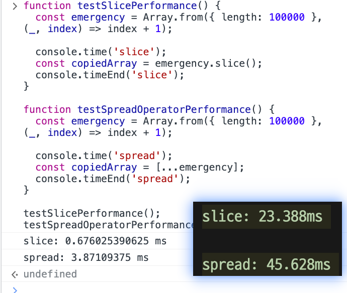

# 진료 순서 정하기

## 문제 설명
외과의사 머쓱이는 응급실에 온 환자의 응급도를 기준으로 진료 순서를 정하려고 합니다. 정수 배열 `emergency`가 매개변수로 주어질 때 응급도가 높은 순서대로 진료 순서를 정한 배열을 `return`하도록 `solution` 함수를 완성해주세요.

## 제한사항
- 중복된 원소는 없습니다.
- 1 ≤ emergency의 길이 ≤ 10
- 1 ≤ emergency의 원소 ≤ 100

## 입출력 예
emergency|result
---|---
[3, 76, 24]|[3, 1, 2]
[1, 2, 3, 4, 5, 6, 7]|	[7, 6, 5, 4, 3, 2, 1]
[30, 10, 23, 6, 100]|	[2, 4, 3, 5, 1]

## 입출력 예 설명

입출력 예 #1

- emergency가 [3, 76, 24]이므로 응급도의 크기 순서대로 번호를 매긴 [3, 1, 2]를 return합니다.

입출력 예 #2

- emergency가 [1, 2, 3, 4, 5, 6, 7]이므로 응급도의 크기 순서대로 번호를 매긴 [7, 6, 5, 4, 3, 2, 1]를 return합니다.

입출력 예 #3

- emergency가 [30, 10, 23, 6, 100]이므로 응급도의 크기 순서대로 번호를 매긴 [2, 4, 3, 5, 1]를 return합니다.

## 풀이

```js
function solution(emergency) {
  const sortedEmergency = [...emergency].sort((a, b) => b - a);
  const result = emergency.map((value) => sortedEmergency.indexOf(value) + 1);
  return result;
}

// 예시 테스트
console.log(solution([3, 76, 24])); // [3, 1, 2]
console.log(solution([1, 2, 3, 4, 5, 6, 7])); // [7, 6, 5, 4, 3, 2, 1]
console.log(solution([30, 10, 23, 6, 100])); // [2, 4, 3, 5, 1]

```


## 성능 개선 풀이

```js
function solution(emergency) {
  const sortedEmergency = [...emergency].sort((a, b) => b - a);
  const indexMap = new Map();

  for (let i = 0; i < sortedEmergency.length; i++) {
    if (!indexMap.has(sortedEmergency[i])) {
      indexMap.set(sortedEmergency[i], i + 1);
    }
  }

  const result = emergency.map((value) => indexMap.get(value));
  return result;
}

// 예시 테스트
console.log(solution([3, 76, 24])); // [3, 1, 2]
console.log(solution([1, 2, 3, 4, 5, 6, 7])); // [7, 6, 5, 4, 3, 2, 1]
console.log(solution([30, 10, 23, 6, 100])); // [2, 4, 3, 5, 1]

```

위의 solution 함수는 주어진 emergency 배열을 복제한 후, 복제된 배열을 응급도의 크기에 따라 내림차순으로 정렬합니다. 그리고 정렬된 배열에서 각 값이 처음 나타나는 인덱스를 indexMap이라는 Map 객체에 저장합니다.

그 후, **원래 배열의 각 요소에 대해 indexMap에서 해당 값에 대응하는 인덱스를 찾아 결과 배열을 구성합니다. 이렇게 하면 중복된 값에 대해서는 정렬된 배열에서 처음 나타난 위치의 인덱스를 재활용할 수 있습니다. 이는 성능을 개선하는 데 도움이 됩니다.**

예를 들어, solution([3, 76, 24])는 [3, 76, 24]를 복제한 후 내림차순으로 정렬하여 [76, 24, 3]을 얻습니다. 그리고 76은 정렬된 배열에서 처음 나타난 위치의 인덱스인 1, 24는 인덱스 2, 3은 인덱스 3입니다. 따라서 [3, 76, 24]의 순서는 [3, 1, 2]가 되어 결과로 반환됩니다.

이 방법은 **Map 객체를 사용하여 값을 인덱스에 대응시키기 때문에 성능적으로 효율적입니다.**


## 배열 복사 성능차이 : `spread` 연산자 vs `slice` 메서드를 이용한 
> `slice` 승!

```js
function testSlicePerformance() {
    const emergency = Array.from({ length: 10000000 }, (_, index) => index + 1);

    console.time('slice');
    const copiedArray = emergency.slice();
    console.timeEnd('slice');
  }
  
  function testSpreadOperatorPerformance() {
    const emergency = Array.from({ length: 10000000 }, (_, index) => index + 1);

    console.time('spread');
    const copiedArray = [...emergency];
    console.timeEnd('spread');
  }

  testSlicePerformance(); 
  testSpreadOperatorPerformance(); 
```

